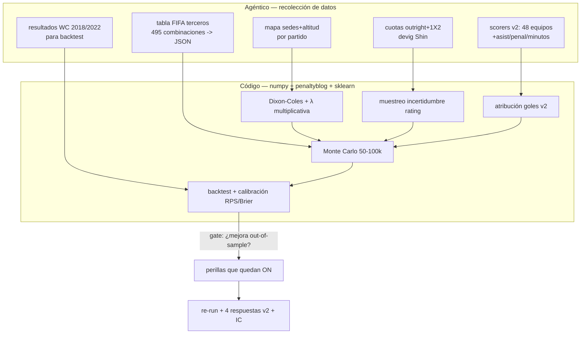

# ✨ Ajustes y calibración del motor Monte Carlo — Ruta B v2

## Overview

Catálogo **exhaustivo** de mejoras al motor `ruta_b/montecarlo.py` y su ejecución
**combinando código (numpy + librerías) y trabajo agéntico (recolección de datos)**.
Alcance elegido: **ejecutar absolutamente todo**, incluyendo lo caro (backtest histórico,
cuotas en vivo, lesiones, Elo dinámico). Lo barato-aunque-de-bajo-valor también entra.

Principio que evita que "todo" se vuelva ruido: **cada parámetro nuevo debe demostrar
mejora out-of-sample** en un backtest 2018/2022 (RPS/Brier). El backtest es la **compuerta**
que decide qué perillas quedan encendidas. Así "hacer todo" no degrada la calibración.

**División código ↔ agéntico (lo mejor de los dos mundos):**
- **Agéntico** = lo que requiere juicio/búsqueda: completar goleadores de los 48 equipos
  con asistencias/penaltis/minutos, cuotas devig, tabla oficial FIFA de terceros, mapa de
  sedes/altitud, resultados históricos para backtest.
- **Código** = lo determinista/rápido: Dixon-Coles, λ multiplicativa, muestreo, atribución
  de goles, MVP, métricas de calibración, 50–100k iteraciones.

---

## Problem Statement / Motivación

El motor actual (auditado, `montecarlo.py`, 241 líneas) tiene simplificaciones que sesgan
las 4 respuestas. Hallazgos clave de la auditoría (con línea):

- **Localía inerte:** `lam()` (`:92-95`) tiene ventaja local `1.05/0.95` pero **todas** las
  llamadas usan `neutral=True` → México/USA/Canadá y la **altitud de CDMX** no se modelan.
- **Modelo de gol aditivo:** λ = `(att+def)/2` (`:93-94`), Poisson independiente → **subestima
  empates bajos** (0-0,1-1) y aplana mismatches (cap `[0.2,3.6]`, `:95`).
- **Rejection sampling de marcador** (`:106-119`) con **fallback frágil** (`:115-116`) que puede
  dejar empate inconsistente y distorsiona `gf/gc` (criterio de desempate de terceros).
- **Terceros greedy** (`assign_thirds`, `:145-153`) ≠ matriz oficial FIFA → cruces R32 no reales.
- **Goleadores:** `OTHER_W=1.2` fijo (`:90`) y **29 de 48 equipos sin ningún goleador listado**
  → Bota de Oro **estructuralmente imposible** para ellos; sesgo pro-grandes.
- **MVP** dominado por `goals_per90*3` (`:219`) → siempre un '9'; ignora creadores/porteros.
- **Sin calibración ni IC:** una semilla, sin backtest, sin error estándar, sin P por ronda volcada.

Diagnóstico de impacto (research best-practices): el **80–90% del valor** está en
**Dixon-Coles + λ multiplicativa + devig de cuotas + backtest**; el resto son retornos
decrecientes que igualmente incluimos por bajo costo, **gateados por el backtest**.

---

## Proposed Solution

Reescribir el corazón estadístico del motor y **cerrar el ciclo con validación**:

1. **Modelo de gol** → Dixon-Coles (matriz de marcadores + corrección ρ≈−0.13) con λ
   **multiplicativa** sobre baseline de goles de selección; opción de ajustar λ por MLE con
   `penaltyblog.models.DixonColesGoalModel` sobre datos históricos.
2. **Fuerza** → devig formal de cuotas (`penaltyblog.implied.shin`) como 4ª ancla; muestreo de
   **incertidumbre de rating** (usar el desacuerdo entre las 3 lentes como desviación).
3. **Contexto** → localía reducida a anfitriones + ajuste de altitud (CDMX/Guadalajara).
4. **Jugadores** → cobertura de los 48 equipos, atribución por minutos + asistencias + penaltis;
   MVP creator-aware.
5. **Estructura** → tabla oficial FIFA de terceros; desempates FIFA; fallback de grupo limpio.
6. **Rigor** → backtest 2018/2022 con **RPS/Brier/log-loss + reliability diagram**, LOTO-CV,
   IC Monte Carlo (Wilson), 50–100k iteraciones; cada perilla validada out-of-sample.

---

## Technical Approach

### Pipeline v2 (código + agéntico)

### Catálogo COMPLETO de ajustes (todas las opciones consideradas)

Valor/Costo: A=alto, M=medio, B=bajo. Q = pregunta de la polla que mejora.
Todos marcados **Ejecutar** (alcance "absolutamente todo"); ✱ = gateado por backtest.

| # | Ajuste | Cód/Ag | Valor | Costo | Mejora | Fase |
|--|--|--|:--:|:--:|--|:--:|
| 1 | **Dixon-Coles** (ρ marcadores bajos) + matriz de marcadores | Cód | A | M | Q1 realismo empates/prórrogas | F2 |
| 2 | **λ multiplicativa** `base·exp(att−def+home)` (deja `(att+def)/2`) | Cód | A | B | Q1 mismatches | F2 |
| 3 | **Devig Shin/power** de cuotas → 4ª ancla de rating | Ag+Cód | A | B | Q1 calibración | F1/F2 |
| 4 | **Localía anfitriones** (MEX/USA/CAN, ~30–50% de liga) | Ag+Cód | M | B | Q1 sedes | F2 |
| 5 | **Altitud** CDMX/Guadalajara (+0.1–0.2 gol aclimatado) ✱ | Ag+Cód | M | B | Q1 | F2 |
| 6 | **Muestreo incertidumbre de rating** (sd = desacuerdo 3 lentes) | Cód | A | B | Q1 IC honesto | F2 |
| 7 | **Sensibilidad por lente** (correr MC con cada lente) | Cód | A | B | Q1 mide error real | F4 |
| 8 | **Cobertura goleadores 48 equipos** (hoy faltan 29) | Ag | A | M | Q3/Q4 | F1 |
| 9 | **Atribución por minutos/titularidad** (no solo g/90) | Ag+Cód | M | B | Q3/Q4 | F3 |
| 10 | **Penaltis como evento** (orden lanzadores, conversión) | Ag+Cód | M | B | Q3/Q4 | F3 |
| 11 | **Asistencias** → MVP creator-aware + reparto | Ag+Cód | M | B | Q2 | F3 |
| 12 | **MVP por rol** (pos, '10'/portero, no solo '9') | Cód | M | B | Q2 | F3 |
| 13 | **Calibrar volumen Bota** a mediana ~6 (rango 5–8, p90 8–9) | Cód | A | B | Q4 | F3 |
| 14 | **OTHER_W proporcional** a Σpesos del equipo | Cód | B | B | Q3 | F3 |
| 15 | **Tabla oficial FIFA de terceros** (deja greedy) | Ag+Cód | M | M | Q1 cruces | F2 |
| 16 | **Desempates FIFA completos** (H2H, fair-play) ✱ | Cód | B | M | Q1 | F2 |
| 17 | **Fallback de marcador de grupo** determinista (bug `:115`) | Cód | M | B | Q1 gf/gc | F2 |
| 18 | **Penales: clamp 0.40–0.60**, pendiente menor | Cód | B | B | Q1 | F2 |
| 19 | **Prórroga con fatiga** (carry de 120'+pen a siguiente) ✱ | Cód | B | M | Q1 | F5 |
| 20 | **Sobredispersión** (nbinom) si backtest lo pide ✱ | Cód | B | B | Q1 | F2 |
| 21 | **Lesiones/suspensiones** por ronda (attrition) ✱ | Ag+Cód | B | M | Q2/Q3 | F5 |
| 22 | **Elo dinámico** in-tournament (momentum) ✱ | Cód | B | M | Q1 | F5 |
| 23 | **Cuotas outright en vivo** como ancla y check de mercado | Ag | M | B | Q1 | F1 |
| 24 | **50–100k iteraciones** + IC Wilson en toda salida | Cód | B | B | todas (ruido) | F4 |
| 25 | **Volcar P por ronda** completa (R16/QF) por equipo | Cód | B | B | Q1 detalle | F4 |
| 26 | **Backtest 2018/2022** (RPS/Brier/log-loss/reliability) | Ag+Cód | A | M | valida TODO | F6 |
| 27 | **LOTO-CV** (leave-one-tournament-out) | Cód | M | M | anti-overfit | F6 |
| 28 | **penaltyblog**: λ por MLE + `implied.shin` | Cód | A | M | Q1 | F2 |

### Componentes de código (con referencias de auditoría)

- **`lam()` (`montecarlo.py:92-95`)** → reescribir a `λ_h = BASE*exp(off_h - def_a + home_adj + alt_adj)`,
  `BASE` calibrado a ~1.35 gol/equipo. Aplica localía/altitud por `venue` del partido.
- **`group_match` (`:106-119`) y `knockout` (`:121-131`)** → muestrear de la **matriz Dixon-Coles**
  (celdas 0..8 por lado × τ(ρ)) en vez de `rng.poisson` independiente. Elimina el rejection-sampling;
  las probs 1X2 de los análisis Ruta A se inyectan como **prior bayesiano sobre λ**, no por rechazo.
- **`attribute` (`:83-104`)** → pesos = `minutes_share·(xg_per90)` + penaltis como evento aparte;
  `OTHER_W` proporcional; cobertura 48 equipos. Trackear asistencias.
- **MVP (`:213-222`)** → `score = goles + 0.7·asist + rol_weight(pos) + depth_bonus`.
- **`assign_thirds` (`:145-153`)** → sustituir greedy por **lookup en tabla FIFA** (JSON nuevo).
- **Salida (`:224-241`)** → añadir IC Wilson, P por ronda completa, `≥N goles` por jugador.
- **Librerías:** `penaltyblog` (Dixon-Coles MLE, `implied.shin`), `scipy.stats` (poisson/nbinom),
  `sklearn` (`brier_score_loss`, `log_loss`, `calibration_curve`), `numpy`.

### Datos nuevos a recolectar (agéntico)

- `scorers.json` v2: 48 equipos × 2–3 goleadores con `xg_per90`, `assists_per90`,
  `penalty_order`, `minutes_share`, `injury_prob`.
- `odds.json`: cuotas outright + 1X2 devig (Shin).
- `thirds_table.json`: matriz oficial FIFA (combinación de grupos con tercero → slots).
- `venues.json`: sede + altitud + flag anfitrión por partido.
- `backtest/wc2018.json`, `wc2022.json`: resultados reales + ratings pre-torneo.

---

## Fases de implementación

### Fase 1 — Datos (agéntico, en paralelo)
- Completar `scorers.json` a 48 equipos (+asist/penal/minutos/lesión).
- Recolectar cuotas devig (Shin) → `odds.json`.
- Formalizar tabla FIFA de terceros → `thirds_table.json`.
- Mapa de sedes/altitud → `venues.json`.
- Resultados WC 2018/2022 → `backtest/`.
- **Éxito:** 5 JSON válidos, cobertura 48/48 goleadores.

### Fase 2 — Modelo de gol (código)
- Dixon-Coles + λ multiplicativa + localía/altitud; fallback de grupo limpio; penales clamp;
  tabla FIFA de terceros; (opt) nbinom; integrar penaltyblog.
- **Éxito:** marcadores realistas (empates ~24–26%, 0-0 plausible); cruces R32 = oficiales.

### Fase 3 — Jugadores (código + datos F1)
- Atribución v2 (minutos/asist/penaltis/cobertura), calibrar Bota a mediana ~6, MVP creator-aware.
- **Éxito:** Bota mediana 5–8; equipos antes excluidos pueden puntuar; MVP admite creadores.

### Fase 4 — Incertidumbre y salida (código)
- Muestreo de incertidumbre de rating; sensibilidad por lente; 50–100k iter; IC Wilson; P por ronda.
- **Éxito:** cada probabilidad con IC; ranking estable entre lentes o divergencia reportada.

### Fase 5 — Realismo KO + dinámicos (código, gateados)
- Fatiga de prórroga, lesiones/attrition, Elo dinámico. Cada uno ON solo si mejora backtest.
- **Éxito:** ninguno empeora RPS out-of-sample.

### Fase 6 — Validación (la compuerta)
- Backtest 2018/2022: RPS/Brier/log-loss + reliability diagram; LOTO-CV; comparar P(campeón) vs
  mercado devig. **Apagar toda perilla que no mejore out-of-sample.**
- **Éxito:** RPS v2 < RPS baseline en histórico; calibración sin sesgo visible.

### Fase 7 — Cierre
- Re-run final; regenerar `RESPUESTAS_FINALES.md` y `COMPARACION_RUTAS.md` con IC.
- **Éxito:** 4 respuestas v2 con intervalos y traza de qué ajustes sobrevivieron el backtest.

---

## Alternativas consideradas (y descartadas como vía principal)
- **Poisson bivariado completo / binomial negativa:** retorno marginal frente a Dixon-Coles
  (la evidencia dice que NB "nunca mejora" al Poisson; el problema es dependencia, no dispersión).
  Se deja `nbinom` solo como prueba gateada (#20).
- **Modelo de penales con parámetros por portero:** máximo riesgo de sobreajuste sin datos
  fiables → se mantiene casi-coinflip (#18).
- **Reescribir el simulador con una lib externa:** no — el bracket de 104 partidos en numpy es
  correcto y rápido; solo se externaliza el **ajuste estadístico** (penaltyblog).

---

## Acceptance Criteria

### Funcionales
- [ ] Dixon-Coles + λ multiplicativa activos en grupos y eliminatoria.
- [ ] Localía/altitud aplicadas por sede (anfitriones ya no neutrales).
- [ ] `scorers.json` cubre 48/48 equipos con asist/penal/minutos.
- [ ] Tabla oficial FIFA de terceros sustituye al greedy.
- [ ] Atribución de goles v2 + MVP creator-aware + Bota calibrada (mediana 5–8).
- [ ] Salida con IC Wilson y P por ronda completa.
- [ ] Backtest 2018/2022 con RPS/Brier/log-loss + reliability diagram implementado.

### No funcionales / calidad
- [ ] **RPS/Brier out-of-sample de v2 ≤ baseline** (si no, esa perilla se apaga).
- [ ] P(campeón) no se aleja injustificadamente del mercado devig.
- [ ] Reproducible (semilla por parámetro); convergencia verificada (2 semillas).
- [ ] Cada ajuste gateado (✱) con veredicto documentado (ON/OFF + métrica).

---

## Success Metrics
- **Calibración:** reliability diagram sin sesgo; RPS v2 < RPS v1 en histórico.
- **Honestidad:** las 4 respuestas v2 salen con **intervalo de confianza**, no punto.
- **Trazabilidad:** tabla de "ajuste → Δ RPS out-of-sample → ON/OFF".

---

## Risk Analysis & Mitigation

| Riesgo | Impacto | Mitigación |
|---|---|---|
| **Sobreajuste** al añadir muchas perillas | Falsa precisión | **Backtest LOTO-CV gatea cada perilla**; priors fuertes en penales/altitud |
| Datos de goleadores incompletos/ruidosos | Bota sesgada | Cobertura 48/48 + calibrar a histórico (mediana 6) |
| Tabla FIFA de terceros mal transcrita | Bracket inválido | Verificar contra fuente (Wikipedia template) + test de cobertura 495 combos |
| penaltyblog/MLE no converge con poca data selección | λ inestable | Fallback a λ multiplicativa manual + ponderación temporal |
| Kaggle requiere API key para backtest | Bloqueo de datos | Agente extrae 2018/2022 de Wikipedia/football-data como respaldo |
| Más iteraciones ≠ más certeza | Pulir botón equivocado | El gasto real va a inputs/calibración, no solo a 100k iter |

---

## References & Research

### Internas (auditoría, file:line)
- `ruta_b/montecarlo.py` — `lam():92-95`, `group_match:106-119`, `knockout:121-131`,
  `attribute:83-104`, `assign_thirds:145-153`, `MVP:213-222`, `salida:224-241`.
- `ruta_b/ratings_*.json`, `ruta_b/scorers.json` (70 jug, 19/48 equipos), `ruta_b/group_probs.json`.

### Externas (research agéntico)
- **Dixon-Coles:** opisthokonta.net/?p=890 · dashee87 (DC + time-weighting).
- **Elo selecciones / λ:** World Football Elo (Wikipedia) · FiveThirtyEight SPI projections.
- **Devig (Shin/power):** betherosports.com/blog/devigging-methods-explained.
- **Altitud:** PMC2151172 (efecto altitud fútbol internacional).
- **Penales ≈ coinflip:** Pinnacle / Opta Analyst.
- **Bota de Oro histórica:** 2014 J.Rodríguez 6, 2018 Kane 6, 2022 Mbappé 8 → mediana ~6.
- **Calibración:** arXiv 2106.14345 (RPS football) · sklearn calibration docs.
- **Librerías:** penaltyblog (docs.pena.lt/y) · scipy.stats · sklearn.
- **Datos backtest:** Kaggle martj42 (resultados 1872+) · Kaggle Elo 1872-2025 · eloratings.net.
- **Blueprint de diseño:** github.com/zvizdo/fifa-wc-2026-simulation (Elo 3-pistas, 100k sims, LOTO-CV).
