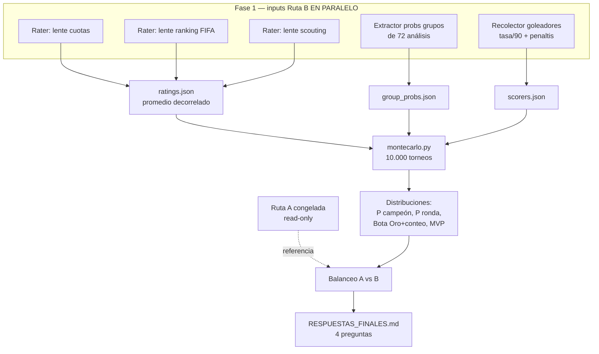

# ✨ Ruta sistemática (Monte Carlo) + balanceo con la ruta agéntica

## Overview

Construir una **segunda ruta de predicción cuantitativa** (Ruta B — Monte Carlo
probabilístico) **en paralelo e independiente** de la ruta ya completada
(Ruta A — simulación agéntica cualitativa, 1 camino de bracket). Al final,
una **revisión de balanceo** reconcilia ambas y entrega las **4 respuestas**
de la polla con su nivel de confianza:

1. **Equipo ganador** (campeón).
2. **Mejor jugador** (MVP del torneo).
3. **Jugador con más goles** (Bota de Oro).
4. **Cuántos goles** tendrá ese goleador.

Principio rector: **independencia metodológica**. La Ruta B se construye
**a ciegas** del resultado de la Ruta A (España campeón, Yamal MVP, etc.) para
evitar sesgo de anclaje. Son dos estimadores distintos —cualitativo agéntico vs
cuantitativo Monte Carlo— y su valor nace de **decorrelación**: si coinciden,
alta confianza; si divergen, lo exponemos.

**Decisiones de diseño confirmadas:**
- Goleador/conteo (P3, P4): **simulación de goles por jugador** sobre la duración
  simulada del recorrido de cada equipo.
- Probabilidades de grupos: **reusar los 72 análisis existentes** (gratis),
  calibradas con ratings para goles/diferencia.
- Robustez: **decorrelar inputs** (3 lentes de rating) **+ 10.000 iteraciones**
  Monte Carlo. (El MC ya converge; repetir corridas completas aporta poco.)

---

## Problem Statement / Motivación

La Ruta A produce **una sola muestra** de un árbol con enorme ramificación
(104 partidos encadenados). Un favorito con 65 % por ronda tiene ~0.65⁷ ≈ **5 %**
de ganarlo todo: un único bracket = una tirada de dado. Además, fijar los grupos
**excluye artificialmente** a equipos que podrían avanzar (p.ej. Irán quedó fuera
por 1 gol en la Ruta A; en la realidad probabilística entra en una fracción de
escenarios). Para dar **certeza cuantificada** —y no una narrativa— necesitamos
**muestrear la distribución completa del torneo**, grupos incluidos.

Dos fuentes de varianza que la Ruta B ataca explícitamente:

| Fuente | Qué es | Cómo se reduce |
|---|---|---|
| Ruido por partido | El modelo duda en un 55/45 | Probabilidad calibrada por partido / rating |
| Varianza de camino | Errores se multiplican ronda a ronda | **Muchos brackets muestreados (10k)** |

---

## Proposed Solution

**Separar ESTIMACIÓN (cara, agentes, una vez) de SIMULACIÓN (barata, código, 10k).**

- Agentes → **ratings de equipo** + **inputs de jugadores** (una pasada).
- Código (Python) → **Monte Carlo de 10.000 torneos completos**: grupos →
  terceros (tabla FIFA oficial) → bracket → final, con goles por jugador.
- Salida = **distribuciones** (no un ganador): P(campeón), P(ronda alcanzada),
  Bota de Oro y su conteo, ranking MVP.
- Balanceo final A vs B → **4 respuestas** con confianza.

El reto técnico y su solución:

| Fase | Reto | Solución |
|---|---|---|
| Grupos | 72 partidos **fijos** | Probabilidad 1X2 (de análisis) + goles Poisson(λ del rating) → tabla y DG |
| Terceros | 8 de 12 grupos, asignación combinatoria | **Tabla oficial FIFA** (matriz verificada, fila por combinación) |
| Eliminatoria | Los cruces **cambian** cada iteración | **Rating continuo (Elo)**: P(A gana)=f(Δrating); el código resuelve cualquier cruce |
| Goleador | Depende de cuántos partidos juega el equipo | Repartir goles del equipo entre sus delanteros (tasa/90 + penaltis) por iteración |

---

## Technical Approach

### Arquitectura de datos

```
polla_mundial_2026/
├── ruta_a/                      # SNAPSHOT congelado de la ruta agéntica (read-only)
│   ├── brackets/  (r32/r16/qf/sf jsons)   # copia
│   └── ruta_a_resumen.md        # campeón, MVP, goleador segun A
├── ruta_b/
│   ├── ratings.json             # 48 equipos: rating, ataque, defensa (3 lentes promediadas)
│   ├── group_probs.json         # 72 partidos: P(1/X/2) extraída de análisis
│   ├── scorers.json             # ~40 candidatos: equipo, pos, goles/90, penaltis(s/n)
│   ├── montecarlo.py            # motor de simulación (10k torneos)
│   ├── mc_results.json          # agregados crudos
│   └── ruta_b_resultados.md     # tablas de probabilidad
├── COMPARACION_RUTAS.md         # balanceo A vs B
└── RESPUESTAS_FINALES.md        # las 4 respuestas
```

### Diagrama de flujo (paralelo → secuencial)



### Motor Monte Carlo (`ruta_b/montecarlo.py`) — especificación

Por cada una de las **10.000 iteraciones**:

1. **Grupos (72 partidos):** para cada partido, goles ~ Poisson(λ_local), Poisson(λ_visita)
   con λ derivado de ataque/defensa de los ratings, **calibrado** para que el
   1X2 promedio coincida con `group_probs.json`. Genera marcador → puntos, GF, GC.
2. **Clasificación + terceros:** ordenar por (pts, DG, GF); tomar 1º, 2º de los 12;
   8 mejores terceros; asignar a slots con la **tabla oficial FIFA**
   (reusar la matriz verificada, fila según combinación de grupos con tercero).
3. **Bracket R32→Final:** enlaces oficiales (reusar `*_bracket.json` como mapa de slots).
   Cada eliminatoria: P(gana A)=logística(k·Δrating); si "empate en 90'",
   prórroga (mismo modelo, menor varianza) y **penales = ~moneda** (50/50 ligado a rating).
   Generar goles del partido (Poisson) para alimentar al goleador.
4. **Goles por jugador:** repartir los goles de cada equipo en cada partido entre
   sus `scorers` por peso = (goles/90 normalizado) + bonus penaltista; acumular
   por jugador a lo largo de su recorrido (más rondas = más oportunidades).
5. **Registrar:** campeón, finalistas, semifinalistas, ronda alcanzada por equipo,
   goles totales por jugador, proxy-MVP.

**MVP (proxy, P2):** puntuación = f(profundidad de ronda del equipo × calidad base
del jugador × (goles+asistencias simulados)). Limitación documentada: el MVP no
emerge "puro" de un MC de equipos; es heurístico calibrado a finalistas/campeón.

**Bota de Oro (P3) y conteo (P4):** por iteración, el jugador con más goles = líder;
agregamos P(jugador es Bota de Oro) y la **distribución del número de goles del líder**
→ reportar mediana + rango (p.ej. "8 goles, rango 6–10").

### Decorrelación de inputs (robustez)

- **Ratings:** 3 agentes independientes con **lentes distintas** (cuotas de casas,
  ranking FIFA, scouting de fichas) → promedio. Diversidad real, no 3 copias del
  mismo sesgo.
- **10k iteraciones:** suficiente para converger P(campeón) a <0.5 % de error MC.
- **Verificación de convergencia:** correr dos bloques de 10k con semillas distintas
  (vía variación de prompt/orden, no `random` prohibido — usar `numpy` con semilla
  fija pasada como parámetro) y comprobar estabilidad de los top-12.

---

## Fases de implementación

### Fase 0 — Congelar Ruta A y definir contrato de salida
- Copiar brackets + picks a `ruta_a/` (snapshot read-only).
- Escribir `ruta_a/ruta_a_resumen.md`: campeón=España, MVP=Yamal, goleador (pick A),
  finalistas, para usar SOLO en el balanceo (no como input de B).
- Definir esquema JSON de respuestas de las 4 preguntas.
- **Criterio de éxito:** Ruta A intacta y aislada; nadie en Fase 1–2 la consulta.

### Fase 1 — Inputs Ruta B (agentes EN PARALELO)
- **B1 · 3 raters decorrelados** → `ratings.json` (rating global + ataque + defensa, 48).
- **B2 · extractor de probabilidades** de los 72 análisis → `group_probs.json`.
- **B3 · recolector de goleadores** (~40: equipo, posición, goles/90, penaltista) → `scorers.json`.
- Todos independientes → un solo fan-out.
- **Criterio de éxito:** 3 JSON válidos; ratings coherentes (favoritos arriba), sin
  contaminación de la Ruta A.

### Fase 2 — Motor Monte Carlo (código)
- Escribir `montecarlo.py` según spec. Reusar lógica de `_gen_clasificacion.py`
  (tablas/tiebreak) y la matriz de terceros + enlaces de bracket ya verificados.
- Correr 10k (×2 para convergencia).
- **Criterio de éxito:** corre en segundos; distribuciones estables entre bloques;
  suma de P(campeón) = 100 %.

### Fase 3 — Resultados Ruta B
- `ruta_b_resultados.md`:
  - **P(campeón)** top-12.
  - **% pase de grupo** de los 48 (aquí aparecen Irán y compañía).
  - **% por ronda** (octavos/cuartos/semis/final) por equipo.
  - **Bota de Oro:** leaderboard con P(líder) y goles esperados; distribución del conteo.
  - **Ranking MVP** (proxy).
  - Partidos/umbrales marcados **toss-up**.
- **Criterio de éxito:** las 4 magnitudes objetivo calculadas con distribución, no punto.

### Fase 4 — Balanceo A vs B (revisión de equilibrio)
- `COMPARACION_RUTAS.md`: tabla por pregunta con vista de A, vista de B (probabilidad),
  acuerdo/divergencia, y respuesta final + confianza.
- **Regla de decisión:**
  - **Campeón / conteo Bota de Oro** → B es primaria (probabilística); A aporta matiz.
  - **Mejor jugador** → A (cualitativa) pesa más; B la respalda/contrasta.
  - **Coinciden** → confianza alta. **Divergen** → exponer ambas + elegir la mejor
    soportada y explicar por qué.
- **Criterio de éxito:** las 4 respuestas con (respuesta, confianza, A-dice, B-dice, razón).

### Fase 5 — Entregable final
- `RESPUESTAS_FINALES.md` con las 4 respuestas y su confianza.
- **Criterio de éxito:** documento de 1 página, claro, accionable para la polla.

---

## Alternativas consideradas

- **3–5 corridas completas de la Ruta B y elegir la consistente** (instinto inicial):
  rechazada como método principal — con 10k iteraciones el MC ya converge; repetir el
  torneo entero da pocas muestras de campeón y confunde ruido con señal. La diversidad
  útil va en los **inputs** (3 lentes de rating), no en repetir la corrida.
- **Fijar grupos y simular solo desde octavos:** rechazada — excluye equipos que podrían
  clasificar y congela mal la siembra (tu reparo, correcto). El MC incluye grupos.
- **Solo modelo de ratings sin análisis de grupos:** descartada como base — perdería el
  matiz cualitativo ya invertido en los 72 análisis. Se usa solo para calibrar goles.

---

## Acceptance Criteria

### Funcionales
- [ ] `ruta_a/` congelada y aislada (no consultada por Fase 1–2).
- [ ] `ratings.json` (48), `group_probs.json` (72), `scorers.json` (~40) generados.
- [ ] `montecarlo.py` corre 10k torneos **incluyendo grupos** (nadie excluido a priori).
- [ ] Salidas: P(campeón) top-12, % pase de grupo de los 48, % por ronda, Bota de Oro
      con conteo, ranking MVP.
- [ ] `COMPARACION_RUTAS.md` con acuerdos/divergencias A vs B.
- [ ] `RESPUESTAS_FINALES.md` responde las **4 preguntas** con confianza.

### No funcionales / calidad
- [ ] Convergencia: top-12 estable entre dos bloques de 10k (Δ < ~1 punto %).
- [ ] Suma de P(campeón) = 100 %; nadie con P(pase de grupo) = 0 si era matemáticamente posible.
- [ ] Tabla de terceros y enlaces de bracket = oficiales (fuente verificada).
- [ ] Independencia: ningún input de B referencia el resultado de A.
- [ ] Bota de Oro reportada como **distribución** (mediana + rango), no punto fijo.

---

## Success Metrics

- **4 respuestas** entregadas, cada una con probabilidad/confianza y soporte de ambas rutas.
- **Grado de acuerdo A↔B** reportado por pregunta (señal de fiabilidad).
- **Calibración:** los favoritos de cuotas reales caen cerca del top de P(campeón) de B.

---

## Dependencies & Risks

| Riesgo | Impacto | Mitigación |
|---|---|---|
| MVP no emerge puro del MC de equipos | P2 más débil | Heurístico calibrado a finalistas; A pesa más en P2 |
| Bota de Oro sensible a error de rating (run-length compuesto) | P3/P4 ruidosas | Reportar distribución, no punto; calibrar tasas/90 con datos reales |
| Goles de grupos necesitan Poisson sano | tablas/DG raras | Calibrar λ contra `group_probs` y goles típicos (1.2–1.5/equipo) |
| Matriz de terceros mal aplicada | bracket inválido | Reusar fuente verificada (Wikipedia template, fila por combinación) |
| Anclaje a Ruta A | pierde independencia | Disciplina: Fase 1–2 a ciegas de A |
| `random`/`Date.now` no disponibles en algunos entornos | no reproducible | `numpy` con semilla pasada por parámetro |

---

## Plan de paralelización (resumen)

- **Ruta A** = ya hecha y **congelada** (coexiste, no se recomputa).
- **Ruta B / Fase 1** = fan-out de **5 agentes** independientes (3 raters + probs + goleadores).
- **Fase 2–3** = código (segundos), secuencial tras Fase 1.
- **Fase 4 (balanceo)** = secuencial, única etapa que mira A y B juntas.

---

## References & Research

### Assets internos a reusar
- `partidos/_gen_clasificacion.py` — lógica de tabla y desempates FIFA.
- `partidos/r32_bracket.json`, `r16_bracket.json`, `qf_bracket.json`, `sf_bracket.json`
  — enlaces oficiales de slots (mapa del bracket).
- `partidos/analisis/**` — 103 análisis (fuente de `group_probs.json` y de tasas/penaltis).
- `equipos/*.md` — 48 fichas (fuente de ratings y goleadores).
- `POLLA_PICKS_DEFINITIVOS.md` — salida de Ruta A (para el balanceo, no como input).

### Externos
- Tabla oficial de terceros FIFA 2026: Wikipedia `Template:2026 FIFA World Cup third-place table`.
- Bracket oficial: Wikipedia `2026 FIFA World Cup knockout stage`.
- Modelo de goles: Poisson/Dixon-Coles (referencia estándar de modelado futbolístico).
